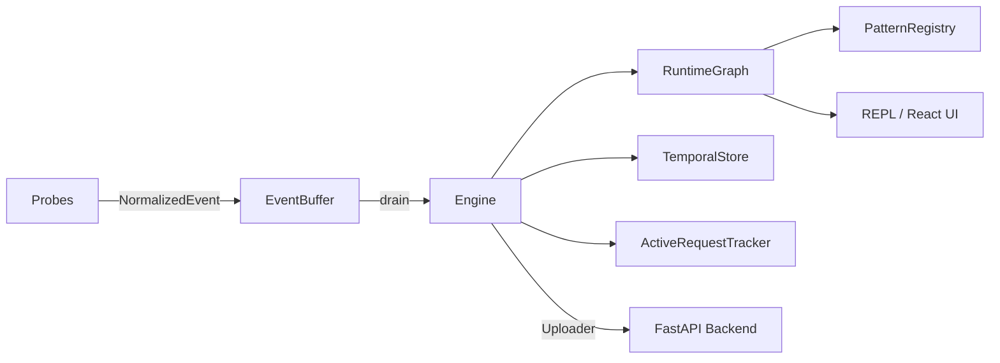

# OriginTracer

**Probe-based Python runtime observability. No decorators. No SDK calls in your views.**

StackTracer instruments the framework hooks — Django middleware, asyncio `Task.__step`, Gunicorn fork callbacks, Uvicorn ASGI middleware — and builds a live causal graph of your running stack from the signals they emit. No code changes in your views. No manual spans. No YAML-driven instrumentation configuration.

```
gunicorn::master  ── spawned ──►  gunicorn::UvicornWorker-24861
                  ── handled ──►  uvicorn::/api/users/
                  ── calls ──►    django::/api/users/
                  ── calls ──►    django::NPlusOneView  ×180
                  ── calls ──►    django::SELECT "auth_user"...  ×90
```

The N+1 pattern surfaces structurally — `NPlusOneView` has 180 calls, the query has 90. No query analysis needed.

---

## What it does

=== "Graph"
    Builds a live `RuntimeGraph` of your stack topology — nodes are services and routes, edges are causal relationships. The graph converges after warmup: 24 nodes after 100 requests or 100,000.

=== "Rules"
    Evaluates causal rules against the graph. Rules detect loop starvation, N+1 queries, retry amplification, worker imbalance, and more. Rules are plain Python predicates — write your own in a `.py` file.

=== "REPL"
    A terminal REPL that queries the live engine via Unix socket. `SHOW nodes`, `SHOW edges`, `CAUSAL`, `DIFF SINCE deployment`, `\stitch <trace_id>` — all from a second terminal while your app runs.

=== "React UI"
    A terminal-aesthetic dashboard — nodes, edges, trace timeline, event log, deployment diffs. Amber on black. Connects to the FastAPI backend.

---

## Quick start

```bash
pip install stacktracer
```

```python
# settings.py — TracerMiddleware must be first
MIDDLEWARE = [
    "stacktracer.probes.django_probe.TracerMiddleware",
    "django.middleware.security.SecurityMiddleware",
    # ...
]
```

```python
# apps.py
from django.apps import AppConfig

class MyAppConfig(AppConfig):
    name = "myapp"

    def ready(self):
        import stacktracer
        stacktracer.init(debug=True)
```

```yaml
# stacktracer.yaml — project root
probes:
  - django
  - asyncio
  - gunicorn
  - uvicorn
```

Then open the REPL in a second terminal:

```bash
python -m stacktracer.scripts.repl

› SHOW nodes
› CAUSAL
› \stitch <trace_id>
```

---

## Architecture



---

## Open source model

The engine, probes, REPL, React UI, and FastAPI backend are MIT licensed.

The **rule libraries** that ship with the book chapters are sold separately at [stacktracer.dev](https://stacktracer.dev). Each chapter covers one layer of the stack — asyncio, Django, nginx, Gunicorn, Celery, database internals — with PDB and GDB traces, and a companion `.py` rule file that detects the patterns described in the chapter automatically in your running system.

Four starter rules ship with the package. They are enough to validate that the tool works in your environment.

---

## Installation

```bash
pip install stacktracer

# optional — for msgpack serialisation (recommended)
pip install msgpack

# optional — for PostgreSQL storage
pip install psycopg2-binary
```

See [Getting Started](getting-started/installation.md) for full instructions.