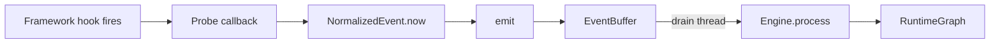

# Probes Overview

Probes are the observation layer. Each probe instruments one framework or library using documented extension points.

## How probes work

Probes call `emit()` for per-request events (goes through the buffer) and `emit_direct()` for lifecycle events (bypasses the buffer, processes immediately).

## Extension points used

| Probe | Extension point | API stability |
|---|---|---|
| Django | `MIDDLEWARE`, `View.dispatch()`, `execute_wrapper` | Stable, documented |
| asyncio | `Task.__step` patch (3.11), `sys.monitoring` (3.12+) | Internal (3.11), public (3.12+) |
| Gunicorn | Server hooks (`post_fork`, `worker_exit`, etc.) | Stable, documented |
| Uvicorn | ASGI middleware | Stable, documented |
| Celery | Signals (`task_prerun`, `worker_process_init`, etc.) | Stable, documented |
| nginx | kprobe + Lua UDP | Kernel-level |
| Redis | `TracedRedis` subclass | Stable |

## Built-in probes

Two probes ship with the open-source package:

- `django` - full probe
- `asyncio` - `create_task` wrapper + loop tick counter

## Advanced probe libraries

The full probe set - nginx, Celery, Redis, database kprobe - ships with the corresponding book chapters at [OriginTracer](https://origintracer.app).

---